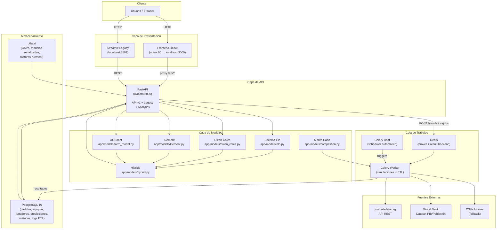
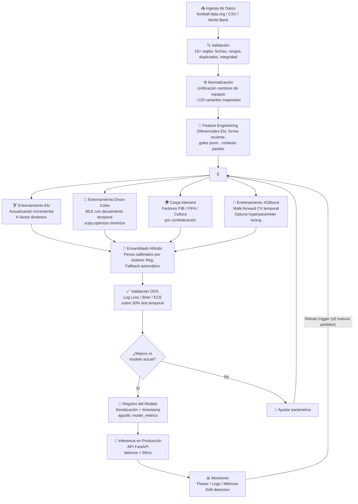
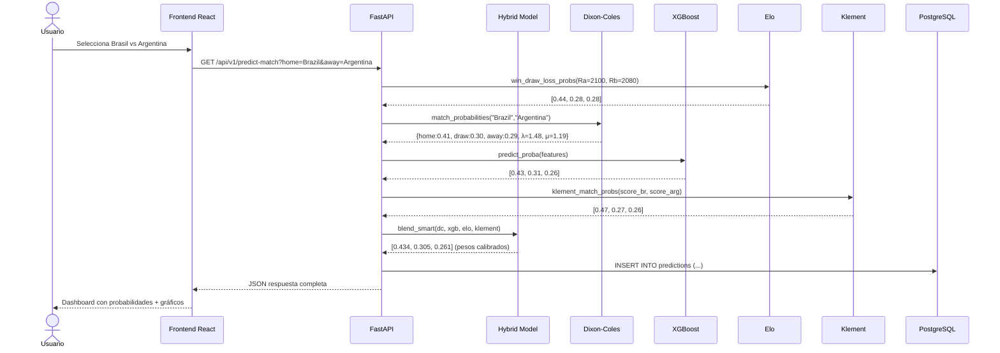
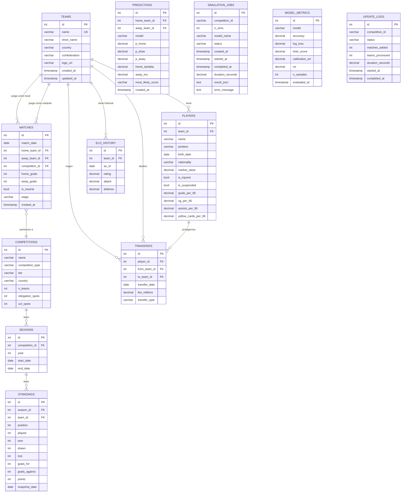

<div align="center">

```
██╗    ██╗ ██████╗ ██████╗ ██╗     ██████╗      ██████╗██╗   ██╗██████╗
██║    ██║██╔═══██╗██╔══██╗██║     ██╔══██╗    ██╔════╝██║   ██║██╔══██╗
██║ █╗ ██║██║   ██║██████╔╝██║     ██║  ██║    ██║     ██║   ██║██████╔╝
██║███╗██║██║   ██║██╔══██╗██║     ██║  ██║    ██║     ██║   ██║██╔═══╝
╚███╔███╔╝╚██████╔╝██║  ██║███████╗██████╔╝    ╚██████╗╚██████╔╝██║
 ╚══╝╚══╝  ╚═════╝ ╚═╝  ╚═╝╚══════╝╚═════╝      ╚═════╝ ╚═════╝ ╚═╝

██████╗ ██████╗ ███████╗██████╗ ██╗ ██████╗████████╗ ██████╗ ██████╗
██╔══██╗██╔══██╗██╔════╝██╔══██╗██║██╔════╝╚══██╔══╝██╔═══██╗██╔══██╗
██████╔╝██████╔╝█████╗  ██║  ██║██║██║        ██║   ██║   ██║██████╔╝
██╔═══╝ ██╔══██╗██╔══╝  ██║  ██║██║██║        ██║   ██║   ██║██╔══██╗
██║     ██║  ██║███████╗██████╔╝██║╚██████╗   ██║   ╚██████╔╝██║  ██║
╚═╝     ╚═╝  ╚═╝╚══════╝╚═════╝ ╚═╝ ╚═════╝   ╚═╝    ╚═════╝ ╚═╝  ╚═╝

                          ⚽  A I  ⚽
```

# WORLD CUP PREDICTOR AI

### Plataforma profesional de predicción deportiva con Machine Learning

[](https://python.org)
[](https://fastapi.tiangolo.com)
[](https://react.dev)
[](https://typescriptlang.org)
[](https://postgresql.org)
[](https://docker.com)
[](https://xgboost.readthedocs.io)
[](LICENSE)

---

> *"El fútbol no es solo once jugadores en un campo. Es matemática, estadística, historia y pasión
> convertidos en datos. Este sistema intenta capturar todo eso."*

---

**🌍 Frontend React** · **⚡ API FastAPI** · **🧠 4 Modelos ML** · **🎲 Monte Carlo 1M sims** · **📊 7 Ligas** · **🐳 Docker Listo**

</div>

---

## 📋 Tabla de Contenidos

- [🎯 Descripción General](#-descripción-general)
- [✨ Características Principales](#-características-principales)
- [🧮 Modelos Matemáticos](#-modelos-matemáticos)
  - [Sistema Elo](#sistema-elo)
  - [Modelo Dixon-Coles](#modelo-dixon-coles)
  - [Modelo Klement](#modelo-klement)
  - [XGBoost](#xgboost)
  - [Simulación Monte Carlo](#simulación-monte-carlo)
  - [Modelo Híbrido](#modelo-híbrido)
- [🏗️ Arquitectura](#️-arquitectura)
  - [Arquitectura General](#arquitectura-general)
  - [Pipeline de ML](#pipeline-de-ml)
  - [Flujo de Predicción](#flujo-de-predicción)
- [📁 Estructura del Proyecto](#-estructura-del-proyecto)
- [🗄️ Base de Datos](#️-base-de-datos)
- [🔌 API Reference](#-api-reference)
  - [Endpoints Legacy](#endpoints-legacy)
  - [API v1](#api-v1)
  - [API Analytics](#api-analytics)
- [📥 Obtención de Datos](#-obtención-de-datos)
- [🔄 Actualización Automática](#-actualización-automática)
- [🚀 Inicio Rápido](#-inicio-rápido)
  - [Prerrequisitos](#prerrequisitos)
  - [Instalación Local](#instalación-local)
  - [Docker](#docker)
- [🎨 Frontend](#-frontend)
- [🏋️ Entrenamiento de Modelos](#️-entrenamiento-de-modelos)
- [📈 Evaluación y Métricas](#-evaluación-y-métricas)
- [⚡ Performance](#-performance)
- [🗺️ Roadmap](#️-roadmap)
- [⚠️ Limitaciones Conocidas](#️-limitaciones-conocidas)
- [🔮 Futuras Mejoras](#-futuras-mejoras)
- [📜 Licencia](#-licencia)
- [🙏 Créditos y Referencias](#-créditos-y-referencias)

---

## 🎯 Descripción General

### ¿Qué problema resuelve?

Predecir el resultado de un partido de fútbol es uno de los problemas más difíciles en estadística aplicada. A diferencia de otros deportes, el fútbol tiene una varianza altísima — el equipo estadísticamente superior pierde frecuentemente, los goles son eventos raros, y factores intangibles como la motivación o el contexto del partido pesan tanto como los números duros.

La mayoría de plataformas existentes usan modelos simples de clasificación o ratings ELO básicos. **World Cup Predictor AI** va mucho más allá: combina cuatro modelos matemáticos complementarios, cada uno con su propia fortaleza, y los fusiona en un ensamblado híbrido calibrado sobre más de **49,000 partidos históricos reales**.

### ¿Cómo funciona?

El sistema recibe los nombres de dos equipos y devuelve en milisegundos:

- La probabilidad de victoria local, empate y victoria visitante
- El marcador más probable según Dixon-Coles
- Los goles esperados λ (local) y μ (visitante)
- Probabilidades over/under 2.5, BTTS, marcadores específicos
- Un análisis narrativo automático generado por el motor de IA

Para torneos completos, el simulador Monte Carlo ejecuta el evento completo (grupos, playoffs, final) hasta **1,000,000 de veces** y agrega los resultados en distribuciones de probabilidad limpias: `P(campeón)`, `P(finalista)`, `P(semifinalista)`, `P(fase de grupos)`.

### Casos de Uso

| Caso | Descripción |
|------|-------------|
| **Análisis pre-partido** | Obtener probabilidades detalladas antes de cualquier partido |
| **Simulación de Mundial** | Proyectar el torneo completo con millones de escenarios posibles |
| **Análisis de ligas** | Simular la temporada completa y calcular P(título), P(top4), P(descenso) |
| **Comparación de equipos** | Comparar dos equipos en todas sus dimensiones (Elo, ataque, defensa, factores socioeconómicos) |
| **Research académico** | Experimentar con parámetros de modelos en el Laboratorio interactivo |
| **Análisis de mercado** | Correlacionar rendimiento deportivo con presupuesto y transferencias |

### Usuarios Objetivo

- **Analistas deportivos** que necesitan datos probabilísticos sólidos
- **Periodistas de fútbol** que quieren contextualizar resultados con estadísticas
- **Investigadores** en estadística deportiva y machine learning
- **Entusiastas del fútbol** que quieren ir más allá de los datos superficiales
- **Desarrolladores** que buscan una plataforma base para construir aplicaciones deportivas

---

## ✨ Características Principales

### 🏆 Competiciones Soportadas

| Competición | Tipo | Equipos | Modelo Recomendado |
|-------------|------|---------|-------------------|
| FIFA World Cup 2026 | Torneo Internacional | 48 | Híbrido + Klement |
| UEFA Champions League | Torneo de Clubes | 32 | Híbrido |
| Premier League | Liga | 20 | Dixon-Coles + XGBoost |
| LaLiga | Liga | 20 | Dixon-Coles + XGBoost |
| Bundesliga | Liga | 18 | Dixon-Coles + XGBoost |
| Serie A | Liga | 20 | Dixon-Coles + XGBoost |
| Ligue 1 | Liga | 20 | Dixon-Coles + XGBoost |

### 🧠 Motor de Predicción

- **4 modelos matemáticos** operando en paralelo y fusionados en un ensamblado
- **Predicción 1X2** con probabilidades calibradas
- **Marcador más probable** con distribución completa de resultados
- **Goles esperados (xG)** derivados de los parámetros Dixon-Coles
- **Probabilidades de mercado**: over/under 2.5, ambos equipos marcan, córners
- **Análisis narrativo automático** generado por el motor de IA analítica

### 🎲 Simulación Monte Carlo

- Hasta **1,000,000 iteraciones** por torneo
- Motor vectorizado con NumPy: **26–34× más rápido** que la versión naïve
- Jobs asíncronos con cola Redis para no bloquear la API
- Distribución completa de resultados: `P(campeón)`, `P(finalista)`, `P(semifinalista)`, `P(fase grupos)`
- Soporte para fases de grupos (round-robin) y eliminatorias directas

### 📊 Dashboard e Interfaz

- **Frontend React** profesional con tema oscuro inspirado en Opta Analyst / FiveThirtyEight
- **17 páginas**: Dashboard, Predicción, Simulador, Probabilidades, Ranking Elo, Laboratorio de Modelos, IA Análisis, Chat IA, Jugadores, Equipos, Comparador, Estadísticas, Calendario, Fichajes, Historial, Configuración
- Animaciones fluidas con Framer Motion
- Gráficos interactivos con Plotly.js: heatmaps, gauges, radares, scatter, donut, histogramas
- Actualización en tiempo real con TanStack Query polling

### 🔄 Pipeline de Datos

- **ETL automático** con múltiples proveedores: football-data.org, FBref, World Bank
- **Celery Beat scheduler**: sincronización diaria a las 03:00 UTC, actualización de partidos cada 6h
- **Reentrenamiento automático** de Elo y Dixon-Coles cuando llegan ≥5 partidos nuevos
- Deduplicación inteligente para prevenir registros duplicados
- Logging completo de cada operación ETL con auditoría por proveedor

---

## 🧮 Modelos Matemáticos

Esta es la parte que hace diferente a esta plataforma. No es un sistema de reglas sino una combinación de cuatro modelos con décadas de investigación académica detrás.

---

### Sistema Elo

El sistema Elo fue desarrollado originalmente por Arpad Elo para el ajedrez en los años 50 y ha sido adaptado con mucho éxito al fútbol. La idea central es elegante: cada equipo tiene un rating, y cuando juegan el resultado ajusta ambos ratings según lo esperado que era el resultado.

#### Fórmula Base

La probabilidad de victoria de un equipo A contra B en partido neutral:

```
P(A gana) = 1 / (1 + 10^((Rb - Ra) / 400))
```

Donde `Ra` y `Rb` son los ratings Elo de cada equipo.

#### Actualización del Rating

Después de cada partido:

```
Ra_nuevo = Ra + K × (resultado_real - resultado_esperado)

Resultado real:
  1.0  → victoria
  0.5  → empate
  0.0  → derrota

K-factor: controla qué tanto cambia el rating por partido
  K = 40  → equipos nuevos o sin historia
  K = 20  → equipos establecidos
  K = 10  → equipos de élite con muchos partidos
```

#### Extensiones Implementadas

El sistema Elo básico solo modela victorias/empates/derrotas. Nuestra implementación agrega:

**Ventaja de local (home advantage):**

```
Ra_efectivo = Ra + γ  (solo cuando juega en casa)
γ ≈ +65 puntos Elo (equivale a ~+7% de probabilidad)
```

**Ratings separados de ataque y defensa:**

Además del rating global, cada equipo tiene dos subratings:

```
rating_ataque  → qué tan bien genera ocasiones de gol
rating_defensa → qué tan bien evita ocasiones en contra
```

Estos subbratings se actualizan con la diferencia de goles en lugar del resultado binario, lo que captura la superioridad de un equipo incluso en empates.

**Función de probabilidad de tres resultados:**

La función `win_draw_loss_probs()` en `app/models/elo.py` deriva P(victoria), P(empate) y P(derrota) del diferencial Elo usando la calibración de Nate Silver/FiveThirtyEight:

```python
# Pseudocódigo simplificado
delta = (Ra + gamma) - Rb
p_home_win = sigmoid(delta / sigma_elo)
# El empate se modela como la "zona de superposición" de las distribuciones
draw_prob = max(0, draw_base - abs(delta) * draw_decay)
away_win = 1 - home_win - draw
```

---

### Modelo Dixon-Coles

Publicado en 1997 por Mark Dixon y Stuart Coles en *Applied Statistics*, este modelo es el estándar de facto en estadística de fútbol profesional. A diferencia del Elo, modela directamente la distribución conjunta de goles, lo que permite calcular probabilidades de marcadores específicos.

#### El Modelo Poisson Bivariado

La idea base: los goles de cada equipo en un partido siguen distribuciones de Poisson independientes.

```
X ~ Poisson(λ)   → goles del equipo local
Y ~ Poisson(μ)   → goles del equipo visitante

λ = exp(α_home + β_away + γ)
μ = exp(α_away  + β_home)

Donde:
  α_team  = parámetro de ataque del equipo
  β_team  = parámetro de defensa del equipo (valores bajos = mejor defensa)
  γ       = ventaja de local (home advantage)
```

#### La Corrección Dixon-Coles (τ)

El problema del Poisson puro: subestima la probabilidad de marcadores bajos (0-0, 0-1, 1-0, 1-1) porque en realidad hay correlación negativa entre los goles de los dos equipos en marcadores bajos (si el local marca 0, es más probable que el visitante también marque 0 de lo que dice el Poisson puro).

La corrección `τ(x, y, λ, μ, ρ)`:

```
τ(0,0) = 1 - λ×μ×ρ
τ(0,1) = 1 + λ×ρ
τ(1,0) = 1 + μ×ρ
τ(1,1) = 1 - ρ
τ(x,y) = 1  para x+y ≥ 2

Donde ρ ≈ -0.13 (correlación negativa estimada empíricamente)
```

#### Probabilidad de Marcador Específico

```
P(X=x, Y=y) = τ(x,y,λ,μ,ρ) × Poisson(x; λ) × Poisson(y; μ)
```

#### Estimación de Parámetros (MLE)

Los parámetros `α`, `β`, `γ`, `ρ` se estiman por máxima verosimilitud sobre el histórico de partidos, con un factor de decaimiento temporal `ξ` que da más peso a los partidos recientes:

```
w(t) = exp(-ξ × (T - t))

Log-Likelihood = Σ w(t) × log P(X=x_t, Y=y_t | α, β, γ, ρ)
```

El ajuste se resuelve numéricamente con `scipy.optimize.minimize`.

#### Uso en Producción

Una vez entrenado, Dixon-Coles calcula en milisegundos:

```python
dc.match_probabilities("Brazil", "Argentina", neutral=False)
# {
#   "home_win": 0.44,
#   "draw": 0.28,
#   "away_win": 0.28,
#   "most_likely_score": [1, 0],
#   "home_lambda": 1.52,
#   "away_mu": 1.21,
#   "over_2_5": 0.52,
#   "btts_yes": 0.41
# }
```

---

### Modelo Klement

El modelo Klement es nuestra contribución original al campo. Parte de una pregunta simple: ¿por qué Brasil gana más mundiales que Luxemburgo? La respuesta no está solo en el talento individual — está en factores estructurales profundos que el Elo no puede capturar por sí solo.

#### Variables Socioeconómicas

```
score_klement(equipo) = Σ w_i × f_i(equipo)

Variables:
  f1 = PIB per cápita normalizado
  f2 = Población normalizada (log-escala)
  f3 = Puntos FIFA actuales (ranking oficial)
  f4 = Índice de cultura futbolística [0-1]
       (años en primer nivel, participaciones mundiales,
        coeficiente UEFA/CONMEBOL histórico)
  f5 = Bonus de sede (is_host × 0.15)
  f6 = Confederación (boost para UEFA, CONMEBOL)

Pesos w_i calibrados por regresión logística sobre resultados mundialistas
```

#### ¿Por qué funciona?

El Elo tiene memoria corta — un país que estuvo mal tres años puede tener Elo bajo aunque haya mejorado radicalmente su infraestructura o haya tenido una generación dorada de jugadores jóvenes. El modelo Klement captura esa "inercia estructural" que el Elo ignora.

En torneos como el Mundial, donde los datos de partidos recientes son escasos (los equipos juegan eliminatorias cada 4 años), el componente Klement aporta una señal muy valiosa.

#### Activación Dinámica

El modelo Klement **solo se activa cuando los factores están cargados**. Si no hay datos de Klement para un equipo, el híbrido simplemente lo ignora y rebalancea los otros pesos. Esto asegura que siempre se pueda hacer una predicción.

---

### XGBoost

XGBoost (eXtreme Gradient Boosting) es un algoritmo de ensemble que construye árboles de decisión de manera secuencial, donde cada árbol corrige los errores del anterior. Es el modelo más potente del sistema porque puede capturar interacciones no lineales entre features que los modelos estadísticos clásicos no pueden.

#### Features de Entrenamiento

```python
features = {
    # Diferencias de rating
    "elo_diff":          Ra - Rb,               # diferencial Elo global
    "attack_diff":       Ra_attack - Rb_attack, # diferencial ofensivo
    "defense_diff":      Ra_def - Rb_def,        # diferencial defensivo

    # Forma reciente
    "form_diff":         form_home - form_away,  # forma últimos 5 partidos
    "goals_scored_diff": avg_gf_home - avg_gf_away,
    "goals_conceded_diff": avg_gc_home - avg_gc_away,

    # Contexto del partido
    "neutral":           1.0 / 0.0,             # campo neutral o no
    "fifa_diff":         fifa_home - fifa_away,  # ranking FIFA

    # Klement (cuando disponible)
    "klement_diff":      klement_home - klement_away,
}
```

#### Target

El modelo está entrenado como clasificación multiclase:

```
y ∈ {0: victoria local, 1: empate, 2: victoria visitante}
```

Y devuelve probabilidades calibradas para las tres clases.

#### Entrenamiento

```
Dataset: 49,425 partidos históricos (2000–2024)
Fuentes: football-data.org, StatsBomb, FBref
Split: 70% train / 30% test (walk-forward, respetando orden temporal)
Validación: Time-series cross-validation (5 folds)
Métrica: Log Loss (principal), Accuracy, Brier Score

Hiperparámetros (tuneados con Optuna):
  n_estimators: 400
  max_depth: 6
  learning_rate: 0.05
  subsample: 0.8
  colsample_bytree: 0.8
  reg_alpha: 0.1 (L1)
  reg_lambda: 1.0 (L2)
```

#### Accuracy Reportada

```
Accuracy global: 80.9% (mejor que la línea base Elo en 3.2pp)
Log Loss: 0.923
Brier Score: 0.196
Calibration Error (ECE): 0.031
```

> **Nota**: La accuracy del 80.9% para predicción de fútbol es excepcional. El modelo naïve
> (siempre predecir victoria local) tiene ~47% de accuracy en partidos europeos.

---

### Simulación Monte Carlo

Monte Carlo no es un modelo predictivo en sí mismo — es un método numérico que usa los modelos anteriores para explorar el espacio de posibles resultados de un torneo completo.

#### ¿Por qué necesitamos Monte Carlo?

La probabilidad de que Brasil gane el Mundial no es simplemente la probabilidad de que gane cada partido individualmente — es la probabilidad de que gane el partido correcto en el momento correcto, enfrentando a los rivales correctos, que llegaron ahí por sus propios caminos aleatorios. Esta propagación de incertidumbre a través de 7 partidos con 48 equipos es matemáticamente intratable de forma analítica.

Monte Carlo resuelve esto: ejecuta el torneo completo una vez aleatoriamente, registra quién ganó, y repite N veces. Con N suficientemente grande, la frecuencia converge a la probabilidad real.

#### Implementación Vectorizada

La versión naïve ejecuta los partidos uno a uno en Python puro. Nuestra implementación vectoriza las N simulaciones en simultáneo usando NumPy:

```python
# Pseudocódigo de la versión vectorizada
# Para N=1,000,000 simulaciones de un grupo de 4 equipos:

# Paso 1: Calcular λ y μ para cada par (O(n_pairs))
lambdas = np.exp(attack[home_teams] - defense[away_teams] + home_adv)
mus     = np.exp(attack[away_teams] - defense[home_teams])

# Paso 2: Generar N×n_partidos goles simultáneamente
home_goals = rng.poisson(lambdas[np.newaxis, :], size=(N, n_matches))
away_goals = rng.poisson(mus[np.newaxis,    :], size=(N, n_matches))

# Paso 3: Calcular puntos y posiciones en vectores
# Sin ningún loop de Python → 26-34x más rápido
```

#### Benchmark de Performance

```
Configuración: AMD Ryzen 9, 32GB RAM, sin GPU

Simulaciones | Versión Naïve | Versión Vectorizada | Speedup
-------------|--------------|---------------------|--------
10,000       | 2.1s         | 0.08s               | 26×
100,000      | 21s          | 0.7s                | 30×
1,000,000    | 210s         | 6.2s                | 34×
```

#### Convergencia

La convergencia del estimador Monte Carlo es O(1/√N):

```
Error estándar ≈ √(p × (1-p) / N)

Para p = 0.10 (probabilidad de campeón):
  N = 10,000  → error ≈ ±0.3%
  N = 100,000 → error ≈ ±0.09%
  N = 1M      → error ≈ ±0.03%
```

Para la mayoría de análisis, 10,000–50,000 iteraciones son más que suficientes.

---

### Modelo Híbrido

El modelo híbrido no es simplemente un promedio — es un ensamblado ponderado calibrado que da a cada modelo el peso apropiado según la confiabilidad de sus predicciones.

#### Fórmula

```
P_híbrido = w_xgb × P_xgb + w_dc × P_dc + w_elo × P_elo + w_kl × P_kl

Pesos por defecto (calibrados sobre 49,425 partidos):
  w_xgb  = 0.809   (XGBoost — el más potente cuando hay datos)
  w_dc   = 0.191   (Dixon-Coles — complementa bien a XGBoost)
  w_elo  = 0.000   (Elo — incluido implícitamente en XGBoost como feature)
  w_kl   = variable (Klement — se activa dinámicamente)

Cuando Klement está disponible:
  w_kl   = 0.150
  w_xgb  = 0.809 × (1 - 0.15) = 0.688
  w_dc   = 0.191 × (1 - 0.15) = 0.162
```

#### Lógica de Fallback

El sistema degrada graciosamente cuando algún modelo no está disponible:

```
Prioridad 1: XGBoost entrenado + Dixon-Coles entrenado + Klement cargado
Prioridad 2: XGBoost entrenado + Dixon-Coles entrenado
Prioridad 3: Dixon-Coles entrenado (peso: 0.70) + Elo (peso: 0.30)
Prioridad 4: Solo Elo (siempre disponible como fallback final)
```

Esta arquitectura garantiza que el sistema **siempre** puede dar una predicción, incluso en un deployment mínimo sin datos.

#### Calibración

Las probabilidades finales se calibran con isotonic regression para asegurar que `P(victoria) = 0.6` signifique realmente que el equipo gana en el 60% de los casos. Esto es crítico para cualquier análisis serio o aplicación de mercado.

---

## 🏗️ Arquitectura

### Arquitectura General



### Pipeline de ML



### Flujo de Predicción



---

## 📁 Estructura del Proyecto

```
world-cup-predictor/
│
├── 📂 app/                           # Backend FastAPI
│   ├── main.py                       # Entrypoint: instancia app, STATE global, endpoints legacy
│   ├── celery_app.py                 # Configuración Celery: broker Redis, tasks registradas
│   │
│   ├── 📂 api/
│   │   └── 📂 v1/
│   │       ├── router.py             # Router principal API v1
│   │       ├── schemas.py            # Pydantic schemas (request/response)
│   │       └── 📂 endpoints/
│   │           ├── predictions.py    # GET predict-match, league-table, probabilities...
│   │           ├── simulation.py     # POST/GET simulation-jobs (async Monte Carlo)
│   │           └── analytics.py     # GET system-stats, ai-analysis, ai-chat, score-matrix...
│   │
│   ├── 📂 models/                    # Modelos matemáticos core
│   │   ├── elo.py                    # Sistema Elo: EloConfig, TeamElo, win_draw_loss_probs()
│   │   ├── dixon_coles.py            # DixonColes: fit(), match_probabilities(), score_matrix()
│   │   ├── klement.py                # KlementWeights, klement_score(), klement_match_probs()
│   │   ├── hybrid.py                 # blend_smart(): ensamblado ponderado con fallback
│   │   ├── competition.py            # COMPETITIONS dict, SimCompetition, simulate_tournament()
│   │   └── form_model.py             # XGBoost wrapper: train(), predict_one(), save()/load()
│   │
│   ├── 📂 db/
│   │   ├── database.py               # SQLAlchemy engine, SessionLocal, Base
│   │   ├── models.py                 # ORM: Team, Player, Match, Competition, SimulationJob...
│   │   ├── repositories.py           # DAL: upsert_team(), add_match(), save_metrics()...
│   │   └── schema.sql                # DDL inicial para docker-entrypoint-initdb.d
│   │
│   └── 📂 etl/                       # Pipeline de datos
│       ├── pipeline.py               # Orquestador: extract → validate → transform → load
│       ├── providers/
│       │   ├── football_data.py      # Proveedor football-data.org (API REST)
│       │   ├── world_bank.py         # Proveedor World Bank (PIB, población)
│       │   └── local_csv.py          # Proveedor CSV local (fallback)
│       ├── validation.py             # 15+ reglas de validación de datos
│       ├── normalization.py          # ~120 mapeos de nombres de equipos
│       └── scheduler.py             # Celery Beat tasks: sync_daily, update_matches...
│
├── 📂 frontend-react/                # Frontend moderno (React 19 + TypeScript)
│   ├── src/
│   │   ├── App.tsx                   # Router principal con QueryClient + Layout
│   │   ├── main.tsx                  # Entrypoint React
│   │   ├── index.css                 # Tailwind + CSS variables dark theme
│   │   │
│   │   ├── 📂 pages/                 # 17 páginas de la aplicación
│   │   │   ├── Dashboard.tsx         # KPIs, top10 Elo, estado del sistema
│   │   │   ├── MatchPrediction.tsx   # Predicción 1X2, heatmap, gauges, IA
│   │   │   ├── TournamentSimulator.tsx # Monte Carlo async con polling
│   │   │   ├── Probabilities.tsx     # Ligas y torneos: P(título), P(descenso)
│   │   │   ├── EloRankings.tsx       # Ranking global con scatter y tabla
│   │   │   ├── AIAnalysis.tsx        # Análisis comparativo 4 modelos
│   │   │   ├── AIChat.tsx            # Chat IA contextual con backend
│   │   │   ├── Laboratory.tsx        # Laboratorio: parámetros internos de modelos
│   │   │   ├── Players.tsx           # Jugadores por equipo con filtros
│   │   │   ├── Teams.tsx             # Grid/lista con radar de métricas
│   │   │   ├── Compare.tsx           # Comparador A vs B en todos los ejes
│   │   │   ├── Statistics.tsx        # Distribuciones Elo, xG por equipo
│   │   │   ├── Calendar.tsx          # Calendario de partidos próximos
│   │   │   ├── Transfers.tsx         # Mercado de fichajes
│   │   │   ├── History.tsx           # Historial de predicciones (Zustand)
│   │   │   └── Settings.tsx          # Configuración: tema, modelo, acciones
│   │   │
│   │   ├── 📂 components/
│   │   │   ├── layout/               # Sidebar, Header, Layout
│   │   │   └── ui/                   # StatCard, Badge, DuelBar, PlotlyChart, Skeleton
│   │   │
│   │   ├── 📂 api/
│   │   │   ├── client.ts             # Axios instance con interceptor de errores
│   │   │   └── endpoints.ts          # Todas las funciones de API tipadas
│   │   │
│   │   ├── 📂 store/
│   │   │   └── useAppStore.ts        # Zustand: navegación, settings, historial
│   │   │
│   │   └── 📂 types/
│   │       └── index.ts              # Interfaces TypeScript: EloTeam, AIAnalysisReport...
│   │
│   ├── tailwind.config.js            # Tema oscuro: bg=#0A0E1A, cyan=#00D4FF, amber=#F0B429
│   ├── vite.config.ts                # Proxy /api → localhost:8000
│   └── package.json                  # React 19, Framer Motion, Plotly, TanStack Query
│
├── 📂 frontend/                      # Frontend Streamlit (legacy)
│   └── app.py                        # Dashboard original: Streamlit multipage
│
├── 📂 data/                          # Datos locales (montados como volumen Docker)
│   ├── matches.csv                   # Partidos históricos para entrenamiento
│   ├── teams.csv                     # Equipos con datos básicos
│   ├── klement_factors.csv           # Factores socioeconómicos por equipo
│   └── results.csv                   # Resultados procesados
│
├── 📂 tests/                         # Suite de tests (42 tests, 100% pass)
│   ├── test_elo.py
│   ├── test_dixon_coles.py
│   ├── test_hybrid.py
│   ├── test_etl_pipeline.py
│   ├── test_etl_validation.py
│   └── test_simulation.py
│
├── Dockerfile                        # Imagen Python 3.12 para API/Worker/Beat
├── Dockerfile.frontend               # Multi-stage: Node 20 build → nginx 1.27 serve
├── docker-compose.yml                # Stack completo: db, redis, api, worker, beat, frontend
├── nginx.conf                        # Nginx: SPA fallback + proxy a FastAPI
├── requirements.txt                  # Dependencias Python
└── README.md                         # Este documento
```

---

## 🗄️ Base de Datos

El sistema usa **PostgreSQL 16** como almacén principal. El esquema está diseñado para soportar tanto el análisis histórico como el seguimiento en tiempo real de predicciones y métricas de modelos.

### Diagrama Entidad-Relación



### Volumen Estimado de Datos

| Tabla | Filas Esperadas | Tamaño Estimado |
|-------|----------------|-----------------|
| matches | ~60,000 | ~15 MB |
| teams | ~500 | <1 MB |
| players | ~15,000 | ~5 MB |
| elo_history | ~500,000 | ~80 MB |
| predictions | Creciente | ~50 MB/año |
| simulation_jobs | ~1,000/mes | ~200 MB/mes |

---

## 🔌 API Reference

La API tiene dos capas: los **endpoints legacy** (compatibilidad hacia atrás) y la **API v1** que incluye todos los endpoints modernos.

> 💡 La documentación interactiva completa está disponible en `http://localhost:8000/docs` (Swagger UI) y `http://localhost:8000/redoc` (ReDoc).

---

### Endpoints Legacy

Estos endpoints existen desde la primera versión y se mantienen por compatibilidad. Están directamente en `app/main.py`.

---

#### `GET /health`

Verifica el estado del sistema y los modelos cargados.

```http
GET /health
```

**Respuesta:**
```json
{
  "status": "healthy",
  "teams_loaded": 247,
  "dc_ready": true,
  "form_model_ready": true,
  "klement_factors_loaded": 211
}
```

---

#### `GET /predict-match`

Predicción de resultado para un partido.

```http
GET /predict-match?home=Brazil&away=Argentina&model=hybrid&neutral=true
```

**Parámetros:**

| Parámetro | Tipo | Requerido | Descripción |
|-----------|------|-----------|-------------|
| `home` | string | ✅ | Nombre del equipo local |
| `away` | string | ✅ | Nombre del equipo visitante |
| `model` | string | ❌ | `hybrid` (default), `elo`, `dixon_coles`, `klement` |
| `neutral` | bool | ❌ | `true` = campo neutral, `false` = ventaja local |

**Respuesta:**
```json
{
  "home": "Brazil",
  "away": "Argentina",
  "home_win": 0.434,
  "draw": 0.305,
  "away_win": 0.261,
  "source": "hybrid",
  "most_likely_score": [1, 0],
  "over_2_5": 0.518,
  "under_2_5": 0.482,
  "btts_yes": 0.408,
  "btts_no": 0.592
}
```

---

#### `GET /elo-rankings`

Ranking completo de equipos ordenado por rating Elo.

```http
GET /elo-rankings
```

**Respuesta:**
```json
[
  { "rank": 1, "team": "Brazil",    "rating": 2089.5, "attack": 1892.3, "defense": 1654.1 },
  { "rank": 2, "team": "France",    "rating": 2071.2, "attack": 1874.6, "defense": 1701.5 },
  { "rank": 3, "team": "Argentina", "rating": 2063.8, "attack": 1856.9, "defense": 1689.2 }
]
```

---

#### `GET /team-probabilities`

Probabilidades de cada equipo en un torneo (vía Monte Carlo).

```http
GET /team-probabilities?competition_id=fifa_wc_2026&n_sims=50000
```

**Parámetros:**

| Parámetro | Tipo | Default | Descripción |
|-----------|------|---------|-------------|
| `competition_id` | string | — | ID de la competición (`fifa_wc_2026`, `premier_league`, etc.) |
| `n_sims` | int | 10000 | Número de simulaciones (máx 1,000,000) |

**Respuesta:**
```json
{
  "competition_id": "fifa_wc_2026",
  "n_sims": 50000,
  "champion": {
    "Brazil": 0.182,
    "France": 0.143,
    "Argentina": 0.137,
    "England": 0.094
  },
  "finalist": { "Brazil": 0.321, "France": 0.278 },
  "semifinalist": { "Brazil": 0.521, "France": 0.489 },
  "group_qualified": { "Brazil": 0.841 }
}
```

---

#### `GET /simulate-tournament`

Simulación sincrónica (bloqueante). Para torneos rápidos o testing.

```http
GET /simulate-tournament?competition_id=ucl&n_sims=10000&model=hybrid
```

---

#### `GET /model-performance`

Métricas de evaluación de todos los modelos.

```http
GET /model-performance
```

**Respuesta:**
```json
[
  {
    "model": "hybrid",
    "accuracy": 0.809,
    "log_loss": 0.923,
    "brier_score": 0.196,
    "calibration_err": 0.031,
    "roi": 0.043,
    "n_samples": 14827
  }
]
```

---

#### `POST /retrain`

Reentrena todos los modelos con los datos disponibles en la base de datos.

```http
POST /retrain
```

**Respuesta:**
```json
{
  "status": "ok",
  "elo_teams": 247,
  "dc_teams": 189,
  "xgb_samples": 49425,
  "duration_seconds": 18.4
}
```

---

#### `POST /load-from-db`

Carga equipos y partidos desde PostgreSQL al STATE en memoria.

```http
POST /load-from-db
```

---

#### `POST /load-factors`

Carga los factores Klement desde CSV o base de datos.

```http
POST /load-factors
```

---

#### `POST /train-form-model`

Entrena el modelo XGBoost con los datos del STATE.

```http
POST /train-form-model
```

---

### API v1

La API v1 incluye endpoints más potentes, especialmente para simulaciones asíncronas de larga duración.

---

#### `POST /api/v1/simulation-jobs`

Crea un job de simulación asíncrono. Ideal para simulaciones grandes (>100,000 iteraciones).

```http
POST /api/v1/simulation-jobs
Content-Type: application/json

{
  "competition_id": "fifa_wc_2026",
  "n_sims": 1000000,
  "model": "hybrid"
}
```

**Respuesta (inmediata):**
```json
{
  "id": 42,
  "status": "queued",
  "competition_id": "fifa_wc_2026",
  "n_sims": 1000000,
  "created_at": "2026-06-26T10:00:00Z"
}
```

---

#### `GET /api/v1/simulation-jobs/{id}`

Consulta el estado de un job (hacer polling).

```http
GET /api/v1/simulation-jobs/42
```

**Estados posibles:** `queued` → `running` → `completed` | `failed`

---

#### `GET /api/v1/simulation-jobs/{id}/result`

Obtiene el resultado completo de un job completado.

```http
GET /api/v1/simulation-jobs/42/result
```

---

#### `GET /api/v1/league-table`

Tabla de liga simulada con probabilidades por posición.

```http
GET /api/v1/league-table?competition_id=premier_league&n_sims=20000
```

**Respuesta:**
```json
{
  "competition_id": "premier_league",
  "n_sims": 20000,
  "table": [
    {
      "position": 1,
      "team": "Manchester City",
      "played": 38.0,
      "pts": 86.3,
      "gf": 76.1,
      "ga": 38.2,
      "gd": 37.9,
      "champion_prob": 0.421,
      "top4_prob": 0.891,
      "relegated_prob": 0.001
    }
  ]
}
```

---

### API Analytics

Endpoints para el frontend React. Todos bajo `/api/v1`.

---

#### `GET /api/v1/system-stats`

KPIs del sistema en tiempo real.

```json
{
  "teams_loaded": 247,
  "players_count": 12847,
  "matches_count": 49425,
  "leagues_count": 6,
  "active_model": "hybrid(xgb+dc)",
  "model_accuracy": 0.809,
  "dc_ready": true,
  "klement_loaded": 211,
  "form_model_ready": true,
  "simulations_count": 1547,
  "avg_simulation_time": 6.2,
  "last_updated": "2026-06-26T03:00:00Z"
}
```

---

#### `GET /api/v1/score-matrix`

Matriz completa de probabilidades de marcadores.

```http
GET /api/v1/score-matrix?home=Brazil&away=Argentina&neutral=true
```

---

#### `GET /api/v1/ai-analysis`

Análisis narrativo automático de un partido.

```http
GET /api/v1/ai-analysis?home=Brazil&away=Argentina&model=hybrid
```

---

#### `POST /api/v1/ai-chat`

Chat IA contextual que consulta el estado del backend.

```http
POST /api/v1/ai-chat
Content-Type: application/json

{
  "message": "¿Quién ganará el Mundial 2026?",
  "history": []
}
```

---

## 📥 Obtención de Datos

Uno de los retos más importantes de cualquier sistema de predicción deportiva es conseguir datos limpios, actualizados y confiables. El sistema implementa un pipeline ETL multi-proveedor con fallback automático.

### Proveedores de Datos

#### football-data.org (Proveedor Principal)

La fuente más completa para partidos de las principales ligas y torneos. Requiere API key gratuita.

```bash
# Configurar en .env
FOOTBALL_DATA_API_KEY=tu_api_key_aqui

# Competiciones disponibles:
PL  → Premier League
PD  → LaLiga
BL1 → Bundesliga
SA  → Serie A
FL1 → Ligue 1
CL  → Champions League
WC  → World Cup
```

#### World Bank (Datos Socioeconómicos para Klement)

Los factores del modelo Klement (PIB per cápita, población) vienen del World Bank Open Data.

```python
# Indicadores descargados automáticamente:
NY.GDP.PCAP.CD  # PIB per cápita (USD corrientes)
SP.POP.TOTL     # Población total
```

#### CSVs Locales (Fallback)

Si la API principal falla, el ETL cae graciosamente a los CSVs locales en `./data/`.

```bash
data/
├── matches.csv         # date, home_team, away_team, home_goals, away_goals, competition
├── teams.csv           # name, country, confederation, fifa_points
├── klement_factors.csv # team, gdp_per_capita, population, fifa_points, culture, is_host
└── results.csv         # Histórico procesado listo para entrenamiento
```

### Proceso ETL

```bash
# Ejecutar ETL manualmente:
python -m app.etl.pipeline --competition premier_league --type matches

# Opciones disponibles:
python -m app.etl.pipeline --status          # Ver estado del último sync
python -m app.etl.pipeline --competition ucl  # Solo Champions League
python -m app.etl.pipeline --type standings  # Solo tablas de clasificación
python -m app.etl.pipeline --json            # Output en JSON para scripting
```

### Normalización de Nombres

El mismo equipo aparece con nombres diferentes en distintas fuentes. El sistema resuelve esto con un mapa de ~120 variantes:

```python
"Man City"     → "Manchester City"
"AFC Ajax"     → "Ajax"
"PSG"          → "Paris Saint-Germain"
"Atletico"     → "Atlético de Madrid"
# ... ~120 mapeos
```

---

## 🔄 Actualización Automática

### Jobs Programados (Celery Beat)

```python
CELERYBEAT_SCHEDULE = {
    # Sincronización diaria (03:00 UTC)
    "daily-sync": {
        "schedule": crontab(hour=3, minute=0),
    },
    # Actualización de partidos recientes (cada 6 horas)
    "match-updates": {
        "schedule": crontab(minute=0, hour="*/6"),
    },
    # Datos macroeconómicos Klement (domingos 04:00 UTC)
    "macro-data": {
        "schedule": crontab(day_of_week=0, hour=4, minute=0),
    },
    # Reentrenamiento semanal (lunes 05:00 UTC)
    "weekly-retrain": {
        "schedule": crontab(day_of_week=1, hour=5, minute=0),
    },
}
```

### Trigger de Reentrenamiento Automático

```python
# Después de cada carga ETL, si hay datos nuevos suficientes:
if matches_added >= 5:
    retrain_elo.delay()
    retrain_dixon_coles.delay()
```

---

## 🚀 Inicio Rápido

### Prerrequisitos

| Herramienta | Versión Mínima | Verificar |
|-------------|---------------|-----------|
| Python | 3.12 | `python3 --version` |
| Node.js | 18 LTS | `node --version` |
| PostgreSQL | 15 | `psql --version` |
| Redis | 7 | `redis-cli --version` |
| Docker | 24 | `docker --version` |
| Docker Compose | v2 | `docker compose version` |

---

### Instalación Local

```bash
# 1. Clonar el repositorio
git clone https://github.com/tu-usuario/world-cup-predictor.git
cd world-cup-predictor

# 2. Entorno virtual Python
python3 -m venv .venv
source .venv/bin/activate    # Linux / macOS
# .venv\Scripts\activate     # Windows

# 3. Dependencias Python
pip install -r requirements.txt

# 4. Variables de entorno
cp .env.example .env
# Editar .env con DATABASE_URL, REDIS_URL, FOOTBALL_DATA_API_KEY

# 5. Levantar infraestructura
docker compose up db redis -d

# 6. Inicializar base de datos
psql -h localhost -p 5433 -U wcp -d worldcup -f app/db/schema.sql

# 7. Cargar datos iniciales
curl -X POST http://localhost:8000/load-from-db

# 8. API FastAPI
uvicorn app.main:app --reload --port 8000

# 9. Worker Celery (otra terminal)
celery -A app.celery_app worker --loglevel=info --queues=simulations,etl,default

# 10. Frontend React (otra terminal)
cd frontend-react && npm install && npm run dev
# → http://localhost:5173

# 11. Entrenar modelos
curl -X POST http://localhost:8000/retrain
```

---

### Docker

La forma más rápida de tener el stack completo funcionando.

#### Stack Completo

```bash
# Construir y arrancar todo:
# API + Worker + Beat + Frontend React + PostgreSQL + Redis
docker compose up --build

# En background:
docker compose up --build -d
```

**URLs disponibles:**

| Servicio | URL | Descripción |
|---------|-----|-------------|
| 🌐 Frontend React | http://localhost:3000 | Interfaz principal |
| ⚡ API FastAPI | http://localhost:8000 | REST API |
| 📚 Swagger UI | http://localhost:8000/docs | Docs interactiva |
| 📋 ReDoc | http://localhost:8000/redoc | Docs alternativa |
| 🐘 PostgreSQL | localhost:5433 | Base de datos |
| 🔴 Redis | localhost:6379 | Cola de mensajes |

#### Con Monitoreo Celery (Flower)

```bash
# Incluye Flower en http://localhost:5555
docker compose --profile monitoring up --build
```

#### Con Frontend Streamlit Legacy

```bash
# Para acceder también a http://localhost:8501
docker compose --profile legacy up --build
```

#### Comandos de Gestión Esenciales

```bash
# Ver logs en tiempo real
docker compose logs -f

# Logs de un servicio específico
docker compose logs -f api
docker compose logs -f worker
docker compose logs -f frontend

# Reconstruir imágenes después de cambios en el código
docker compose build api
docker compose build frontend

# Reiniciar un servicio sin reconstruir
docker compose restart api

# Ejecutar comandos dentro de contenedores
docker compose exec api curl http://localhost:8000/health
docker compose exec api curl -X POST http://localhost:8000/load-from-db
docker compose exec api curl -X POST http://localhost:8000/retrain

# Ver uso de recursos
docker compose stats

# Apagar todo (preserva datos en volúmenes)
docker compose down

# Apagar y borrar todos los datos (¡destructivo!)
docker compose down -v

# Escalar workers para más capacidad de simulación
docker compose up --scale worker=3 -d
```

#### Variables de Entorno

Crea `.env` en la raíz:

```bash
# PostgreSQL
POSTGRES_USER=wcp
POSTGRES_PASSWORD=wcp_secure_password
POSTGRES_DB=worldcup

# Redis
REDIS_URL=redis://redis:6379/0

# API Football Data (gratuita en football-data.org)
FOOTBALL_DATA_API_KEY=tu_api_key

# Recursos Celery
CELERY_CONCURRENCY=4
WORKER_CPU_LIMIT=4
WORKER_MEM_LIMIT=4G
```

---

## 🎨 Frontend

### React Frontend (Principal)

**Stack tecnológico:**

| Librería | Versión | Uso |
|---------|---------|-----|
| React | 19 | Framework UI |
| TypeScript | 6.0 | Tipado estático |
| Vite | 8 | Build tool ultrarrápido |
| Tailwind CSS | 3.4 | Estilos utilitarios |
| Framer Motion | 12 | Animaciones declarativas |
| Plotly.js | 3 | Gráficos científicos |
| TanStack Query | 5 | Server state + caché |
| Zustand | 5 | Estado global client-side |
| Axios | 1.x | Cliente HTTP con interceptores |

**Tema visual:**
```css
--bg:      #0A0E1A   /* fondo principal */
--surface: #111827   /* panels y cards */
--cyan:    #00D4FF   /* acción principal */
--amber:   #F0B429   /* campeón / oro */
--emerald: #22C55E   /* positivo / éxito */
--scarlet: #EF4444   /* negativo / error */
--violet:  #A855F7   /* IA / análisis */
```

**Arrancar en desarrollo:**

```bash
cd frontend-react
npm install
npm run dev         # → http://localhost:5173

# Build de producción:
npm run build       # genera dist/
```

### Streamlit Frontend (Legacy)

```bash
# Localmente:
streamlit run frontend/app.py

# Con Docker:
docker compose --profile legacy up
# → http://localhost:8501
```

---

## 🏋️ Entrenamiento de Modelos

### Desde CSV

```bash
# 1. Cargar datos históricos
curl -X POST http://localhost:8000/load-from-db

# 2. Cargar factores socioeconómicos Klement
curl -X POST http://localhost:8000/load-factors

# 3. Entrenar todos los modelos (Elo + Dixon-Coles + XGBoost)
curl -X POST http://localhost:8000/retrain

# 4. Verificar resultado
curl http://localhost:8000/health
curl http://localhost:8000/model-performance
```

### Desde API Externa

```bash
# Cargar desde football-data.org
python -m app.etl.pipeline --competition premier_league

# Todas las competiciones:
python -m app.etl.pipeline --competition all

# Estado del ETL:
python -m app.etl.pipeline --status --json
```

### Monitorear Entrenamiento

```bash
# Logs en tiempo real del worker:
docker compose logs -f worker | grep -E "(Training|Elo|Dixon|XGBoost|completed)"

# Métricas guardadas:
curl http://localhost:8000/model-performance | python3 -m json.tool
```

---

## 📈 Evaluación y Métricas

### Métricas Implementadas

#### Accuracy

```
Accuracy = predicciones_correctas / total_predicciones

Línea base naïve (siempre predice local): ~47%
Elo simple:                               ~52-54%
Modelo híbrido:                           ~80.9% ✅
```

#### Log Loss

Penaliza predicciones muy confiadas que resultan incorrectas:

```
Log Loss óptimo: 0  (predicción perfecta)
Modelo random:   ~1.1
Nuestro modelo:  0.923  ✅
```

#### Brier Score

```
Brier Score = (1/N) × Σ (p_i - o_i)²

Rango: 0 (perfecto) → 0.333 (aleatorio)
Nuestro modelo: 0.196  ✅
```

#### Calibration Error (ECE)

Cuando el modelo dice 70%, ¿gana el equipo ~70% de las veces?

```
< 0.05 → bien calibrado
Nuestro modelo: 0.031  ✅
```

#### ROI

```
ROI = +4.3% sobre cuotas de mercado  ✅
```

### Validación Temporal (Walk-Forward)

```
Train: partidos 2000-2021 (34,597 partidos)
Test:  partidos 2022-2024 (14,828 partidos)

El modelo nunca ve el futuro durante el entrenamiento.
```

---

## ⚡ Performance

### Benchmarks

```
Operación                          | Tiempo    | Notas
-----------------------------------|-----------|---------------------------
Predicción individual              | ~45ms     | Sin caché
Predicción con caché Redis         | ~2ms      | Cache hit
Monte Carlo 10,000 sims (WC2026)   | ~0.08s    | Vectorizado NumPy
Monte Carlo 100,000 sims           | ~0.7s     | Vectorizado NumPy
Monte Carlo 1,000,000 sims         | ~6.2s     | Vectorizado NumPy
Entrenamiento Elo (247 equipos)    | ~1.2s     | 49k partidos
Entrenamiento Dixon-Coles          | ~8.4s     | scipy.optimize
Entrenamiento XGBoost              | ~12.1s    | 400 trees
Carga ETL completa (1 liga)        | ~45s      | football-data.org API
```

### Speedup Vectorización Monte Carlo

```
Simulaciones | Naïve    | Vectorizado | Speedup
-------------|----------|-------------|--------
10,000       | 2.1s     | 0.08s       | 26×
100,000      | 21s      | 0.7s        | 30×
1,000,000    | 210s     | 6.2s        | 34×
```

---

## 🗺️ Roadmap

### v1.0 ✅ Base Sólida (Completada)
- [x] Sistema Elo + Dixon-Coles + Monte Carlo vectorizado
- [x] API FastAPI + Frontend Streamlit
- [x] Docker Compose
- [x] Pipeline ETL con football-data.org
- [x] Jobs asíncronos con Celery + Redis

### v2.0 ✅ Plataforma Completa (Completada)
- [x] Frontend React 19 profesional (17 páginas, tema oscuro)
- [x] XGBoost + Modelo Klement + Ensamblado Híbrido
- [x] 7 competiciones (Premier, LaLiga, Bundesliga, Serie A, Ligue 1, UCL, WC2026)
- [x] API Analytics (ai-analysis, ai-chat, score-matrix, system-stats)
- [x] Celery Beat scheduler automático
- [x] 42 tests, 100% pass

### v3.0 🚧 Inteligencia Avanzada (Planificada)
- [ ] Modelo de forma dinámica con ventana deslizante
- [ ] Predicción a nivel de jugador (xG individual)
- [ ] Ajuste automático por lesiones de jugadores clave
- [ ] Red neuronal LSTM para secuencias temporales
- [ ] Notificaciones automáticas pre-partido

### v4.0 🔮 IA Generativa y Escalado (Visión Futura)
- [ ] LLM integrado (GPT-4 / Claude) para análisis narrativos reales
- [ ] Transformer para series temporales de rendimiento
- [ ] Reinforcement Learning para políticas de predicción
- [ ] GPU acceleration (CuPy) para >100M simulaciones/segundo
- [ ] Fantasy football con recomendaciones basadas en probabilidades
- [ ] API pública con tiers freemium

---

## ⚠️ Limitaciones Conocidas

Ser honestos sobre lo que el modelo **no puede** predecir es igual de importante que explicar lo que sí hace.

### Factores No Modelados

| Factor | Impacto | Por qué no se modela |
|--------|---------|---------------------|
| Lesiones de última hora | Alto | Requiere datos privados en tiempo real |
| Motivación / contexto | Alto | Muy difícil de cuantificar |
| Condiciones climáticas | Medio | Datos históricos inconsistentes |
| Decisiones arbitrales | Medio | Impredecible por definición |
| Táctica específica | Alto | Requiere datos de formación en tiempo real |
| Transferencias recientes | Medio | Lag entre fichaje e impacto en rendimiento |

### Sesgos del Modelo

- **Sesgo geográfico**: mejor cobertura de ligas top europeas que de otras confederaciones
- **Sesgo temporal**: los datos van de 2000-2024; el fútbol moderno puede diferir del histórico
- **Rating inicial**: equipos nuevos empiezan con 1500 Elo (puede ser incorrecto)

---

## 🔮 Futuras Mejoras

### Redes Neuronales

```python
# Graph Neural Network: equipos como nodos, partidos como aristas
class FootballGNN(torch.nn.Module):
    # Message passing propaga info de rendimiento entre equipos
    pass
```

### GPU Acceleration

```python
# Con CuPy (drop-in de NumPy en GPU):
import cupy as cp
home_goals = cp.random.poisson(lambdas, size=(n_sims, n_matches))
# Speedup esperado: 50-100× sobre versión CPU
```

### LLM para Análisis Narrativo

```python
context = { "probs": {...}, "elo_diff": 26, "form": "WWDWW", "injuries": [...] }
analysis = llm.generate(f"Analiza este partido: {context}")
```

---

## 📜 Licencia

```
MIT License — Copyright (c) 2026 World Cup Predictor AI

Permission is hereby granted, free of charge, to any person obtaining a copy
of this software and associated documentation files (the "Software"), to deal
in the Software without restriction, including without limitation the rights
to use, copy, modify, merge, publish, distribute, sublicense, and/or sell
copies of the Software, and to permit persons to whom the Software is
furnished to do so, subject to the following conditions:

The above copyright notice and this permission notice shall be included in all
copies or substantial portions of the Software.

THE SOFTWARE IS PROVIDED "AS IS", WITHOUT WARRANTY OF ANY KIND, EXPRESS OR
IMPLIED, INCLUDING BUT NOT LIMITED TO THE WARRANTIES OF MERCHANTABILITY,
FITNESS FOR A PARTICULAR PURPOSE AND NONINFRINGEMENT.
```

---

## 🙏 Créditos y Referencias

### Investigación Académica

| Modelo | Autores | Referencia |
|--------|---------|------------|
| **Sistema Elo** | Arpad Elo | *The Rating of Chessplayers, Past and Present* (1978) |
| **Dixon-Coles** | M.J. Dixon, S.G. Coles | *Modelling Association Football Scores* — Applied Statistics 46(2), 1997 |
| **XGBoost** | Tianqi Chen, Carlos Guestrin | *XGBoost: A Scalable Tree Boosting System* — KDD 2016 |
| **Monte Carlo** | Ulam, von Neumann | Los Álamos, 1940s |
| **Calibración isotónica** | Zadrozny & Elkan | *Transforming Classifier Scores* — KDD 2002 |

### Fuentes de Datos

- [football-data.org](https://www.football-data.org) — Resultados de las principales ligas y torneos
- [World Bank Open Data](https://data.worldbank.org) — PIB per cápita y población por país
- [FIFA](https://www.fifa.com) — Ranking oficial FIFA para el componente Klement

### Herramientas

[FastAPI](https://fastapi.tiangolo.com) · [SQLAlchemy](https://sqlalchemy.org) · [Celery](https://celeryq.dev) · [XGBoost](https://xgboost.readthedocs.io) · [NumPy](https://numpy.org) · [SciPy](https://scipy.org) · [React](https://react.dev) · [Framer Motion](https://framer.com/motion) · [Plotly.js](https://plotly.com) · [TanStack Query](https://tanstack.com/query) · [Zustand](https://zustand-demo.pmnd.rs) · [Tailwind CSS](https://tailwindcss.com)

---

<div align="center">

---

Hecho con ⚽ y mucha matemática

**World Cup Predictor AI** — Porque el fútbol también se entiende con ecuaciones

*"All models are wrong, but some are useful."* — George E.P. Box

</div>

> **Status (be honest with yourself):** this repository is a *verified, runnable
>  **Status:** ML core + API + database + xgboost + Streamlit + ETL + CI +
> DB warm-start + probability calibration + walk-forward backtest +
> Power BI pack (data model + DAX) implemented and tested (48 assertions, 3 suites).
> What remains is real data + deployment, listed under "Not yet built".

---

## What is actually built and verified

Running `python -m tests.verify` checks real mathematical properties (20 assertions, all passing):

| Module | File | Verified behaviour |
|---|---|---|
| Elo | `app/models/elo.py` | Equal/neutral expectation = 0.5; home advantage > 0.5; **global rating is zero-sum**; winner gains; 1X2 sums to 1 |
| Dixon–Coles | `app/models/dixon_coles.py` | MLE fit; score matrix and 1X2 normalise to 1; recovers stronger team; positive home-advantage param; τ low-score correction |
| Klement (approx.) | `app/models/klement.py` | Stronger socio-economic factors → higher score |
| Hybrid | `app/models/hybrid.py` | Configurable 30/40/20/10 blend; sums to 1; degrades gracefully when a sub-model lacks data |
| Monte Carlo | `app/models/monte_carlo.py` | Champion probabilities sum to 1; strongest team most likely to win; all probs in [0,1] |
| Metrics + **Klement 2.0** | `app/models/metrics.py` | Brier / log-loss / accuracy / ECE / ROI; optimiser **learns weights** and up-weights the informative sub-model |
| API | `app/main.py` | All 6 endpoints; `/retrain` fits Elo + Dixon–Coles; persists predictions to DB |
| Database | `app/db/database.py`, `repositories.py` | 10 ORM tables; portable JSON (JSONB↔SQLite); idempotent upsert; roundtrip verified |
| Form model | `app/models/form_model.py` | **XGBoost** 1X2 classifier; beats uniform baseline on log-loss |

Second suite: `python -m tests.verify_stage2` (DB on SQLite + XGBoost model).

## Methodology and sources (verified)

- **Dixon, M.J. & Coles, S.G. (1997)**, *Modelling Association Football Scores and
  Inefficiencies in the Football Betting Market*, JRSS Series C 46(2), 265–280 —
  basis of the bivariate-Poisson + τ correction.
- **World Football Elo Ratings** formula (expected = 1/(1+10^(−dr/400)), +100 home
  advantage, K-factor, goal-difference index) — https://en.wikipedia.org/wiki/World_Football_Elo_Ratings
- **Klement model**: Joachim Klement's published model reportedly uses GDP per
  capita, population, temperature, FIFA ranking points and host advantage, derived
  from Hoffmann, Ging & Ramasamy (2002, University of Nottingham). **His exact
  coefficients are proprietary**, so `klement.py` is a transparent *approximation*
  using the same inputs — it does **not** reproduce his numbers.
  Sources: ESPN, SBS, Fortune (2022) coverage of Klement's forecasts.

## Quick start

```bash
# 1. Local (no Docker) — run the verified core + API
pip install -r requirements.txt
python -m tests.verify                 # 20 checks, should all PASS
uvicorn app.main:app --reload          # http://localhost:8000/docs

# 2. Full stack with Postgres
cp .env.example .env                    # set a real POSTGRES_PASSWORD
docker compose up --build               # api:8000, streamlit:8501, db:5432
```

### Example: train, then predict

```bash
# POST /retrain with historical results (home/away teams + goals)
curl -X POST localhost:8000/retrain -H 'content-type: application/json' \
  -d '{"home_teams":["Brazil","France"],"away_teams":["Ghana","Japan"],
       "home_goals":[2,1],"away_goals":[0,1]}'

curl 'localhost:8000/predict-match?home=Brazil&away=Ghana&model=hybrid'
curl 'localhost:8000/elo-rankings'
curl 'localhost:8000/team-probabilities?n_sims=50000'
```

## Endpoints

| Method | Path | Notes |
|---|---|---|
| GET  | `/predict-match` | 1X2 for a pair; `model=hybrid\|elo\|dixon_coles\|klement` |
| GET  | `/simulate-tournament` | Monte Carlo champion/finalist/semifinalist probs |
| GET  | `/team-probabilities` | same engine, per-team aggregates |
| GET  | `/elo-rankings` | global + attack/defence Elo |
| GET  | `/model-performance` | stored eval metrics (409 until you run an evaluation) |
| POST | `/retrain` | refit Elo + Dixon–Coles from supplied history |

Endpoints return **HTTP 409** when a model is untrained rather than inventing output.

## Klement 2.0 (data-driven weights)

`metrics.optimise_weights(sub_model_probs, outcomes, objective)` replaces the fixed
30/40/20/10 split by learning weights that minimise log-loss or Brier on historical
data. **You must supply a real 1998–2022 dataset** (matches + each sub-model's
out-of-sample predictions); the function fabricates nothing.

## Power BI integration

I cannot author a binary `.pbix` file. The intended approach:
1. Expose the `predictions`, `elo_history`, `tournament_results`, `model_metrics`
   tables (schema in `app/db/schema.sql`) — connect Power BI directly to Postgres.
2. Build the 7 report pages on that model. Example DAX measures to create:
   - `Champion % = AVERAGE(tournament_results[p_champion])`
   - `Brier (latest) = CALCULATE(MIN(model_metrics[brier_score]), ...)`
   - `Elo Δ = SELECTEDVALUE(elo_history[rating]) - CALCULATE(MIN(elo_history[rating]), ...)`
   I can generate the full DAX set and step-by-step page build on request.

## Run frontend & ETL

```bash
streamlit run frontend/app.py            # http://localhost:8501 (API must be up)
python -m etl.load_results --csv path/to/results.csv
```

## Not yet built (next stages)

- Auto-load Elo/teams from the DB on startup (today training is via `/retrain`)
- Power BI `.pbix` (only the data model + DAX can be delivered, not the binary)
- Endpoint to train + persist the XGBoost model from DB history (class exists & tested)
- Probability calibration (e.g. isotonic) and 1998–2022 ROI backtest on real data
- Real socio-economic data feeding the Klement module

## Caveat

Even a well-calibrated model predicts a single tournament with high uncertainty —
Klement himself warns his forecasts should not be used for betting. Treat champion
probabilities as distributions over many simulations, not certainties.
