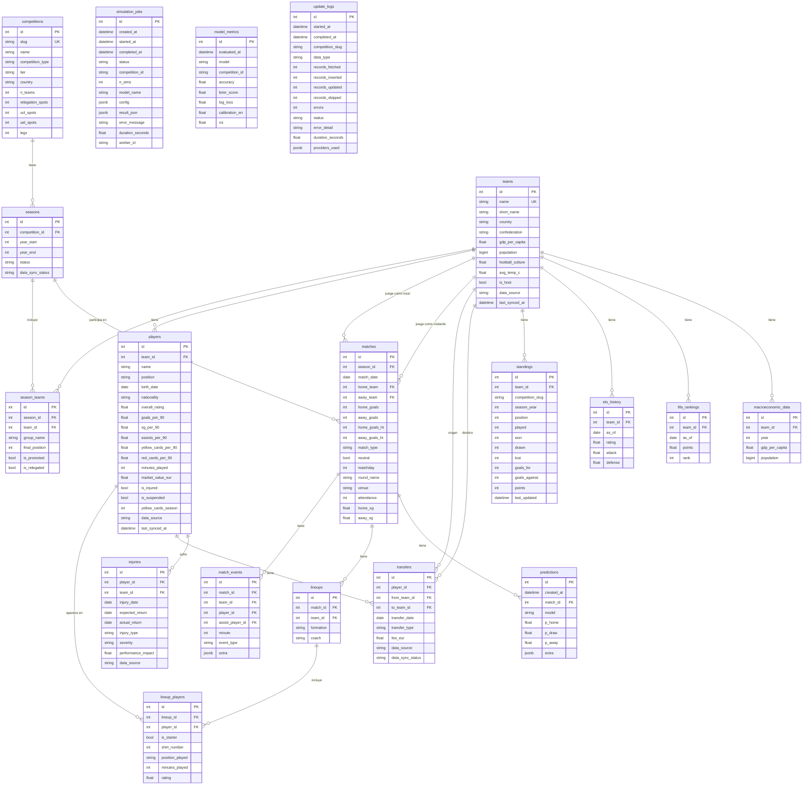

# Diagrama Entidad-Relación — World Cup Predictor AI

## ERD Mermaid

## Descripción de tablas principales

| Tabla | Propósito |
|-------|-----------|
| `competitions` | Catálogo de competiciones (Mundial, UCL, PL, etc.) |
| `seasons` | Temporadas por competición con estado de sincronización |
| `season_teams` | Equipos participantes en cada temporada (club o selección) |
| `teams` | Equipos: tanto clubes como selecciones nacionales |
| `players` | Jugadores con estadísticas completas per-90 |
| `matches` | Partidos con resultados, xG y metadata |
| `match_events` | Goles, tarjetas, sustituciones por partido |
| `lineups` | Alineaciones por partido y equipo |
| `transfers` | Fichajes reales (fee, tipo, fecha) |
| `injuries` | Lesiones con gravedad e impacto en rendimiento |
| `standings` | Clasificaciones de liga actualizadas por ETL |
| `elo_history` | Histórico de ratings Elo por equipo y fecha |
| `predictions` | Predicciones 1X2 guardadas por modelo |
| `simulation_jobs` | Jobs de Monte Carlo asíncronos con estado |
| `model_metrics` | Métricas de evaluación de modelos |
| `update_logs` | Auditoría de ejecuciones del ETL |
